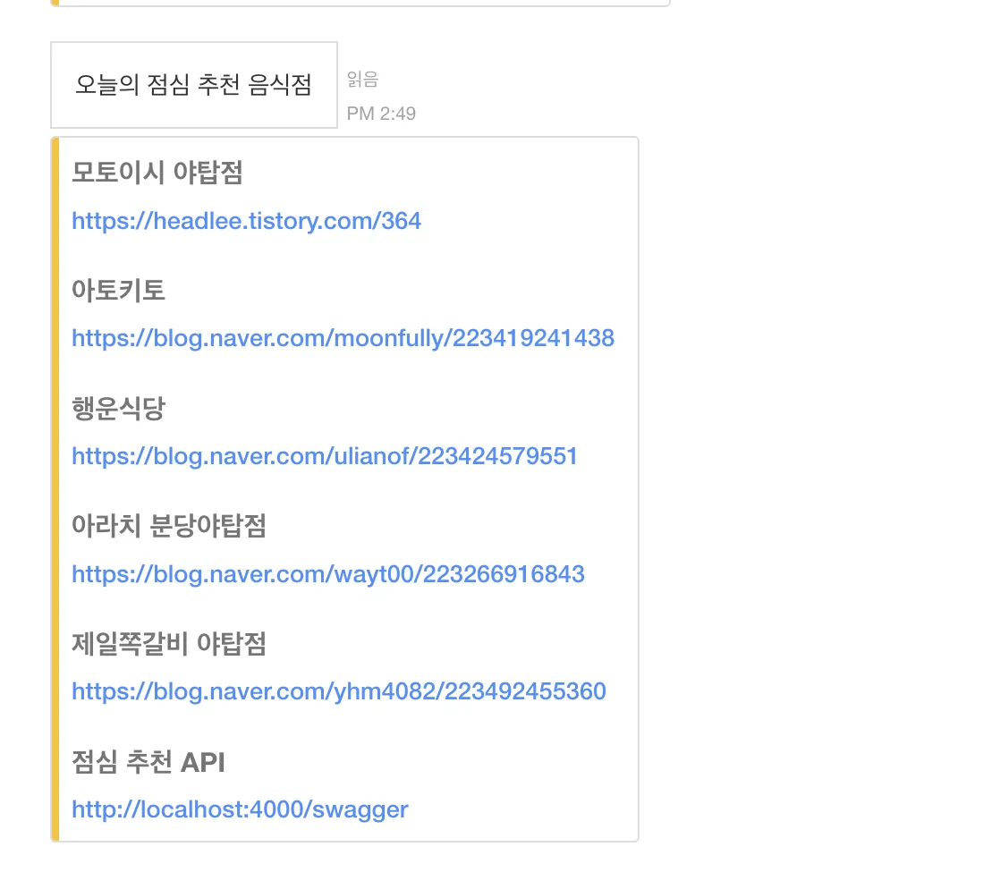

# 점심 선택을 잘 못 하는 팀원들을 위한 간단한 점심 추천 서비스

WEB의 경우 직접 접속하는 번거로움과 데이터 업데이트에 대한 불편함을 해소하고자 공공데이터 CSV파일을 활용하여 주기적으로 업데이트 및 Jandi Webhook을 발송하는 Server 개발

#### 서버 실행 방법

```
// code clone
git clone https://github.com/lee-jong/lunch-recommand-server.git

// 저장소 삭제
rm -rf .git

// 본인의 저장소 연결
git init
git remote add origin [추가할 원격 git 저장소 주소]

npm ci
npm run dev
```

### 준비

1. 공공데이터 준비 [링크](https://www.data.go.kr/data/15076265/fileData.do)
2. 서버를 실행 후 swagger 접속 [swagger - (local)](http://locahost:4000)
3. [Upload](http://localhost:4000/swagger/#/Upload) API를 사용하여 공공데이터 홈페이지에서 받은 CSV파일 업로드
4. lib > schedule.ts에 발송 주기 셋팅 [guide 링크](https://www.npmjs.com/package/node-schedule)
5. helper > upload.ts 에 상호명 주소 예외 처리 ( 이건... 좀 귀찮 )

### 환경변수

```
.env
	WEBHOOK_URL="Jandi에서 발급받은 webhook url"
	KAKAO_API_KEY ="kakao develop에서 발급 받은 API key"

.env.[ local | develop | prod ]
	SERVER_HOST="localhost"
	SERVER_PORT="4000"
	SERVER_URL="http://localhost:4000"
```

#### 결과



#### 보완점

1. 필터를 위해 직접적으로 입력하는 게 너무 귀찮다. ( 위치 입력시 주변 한정으로 자연스럽게 처리할 수 있도록 개선 필요 )
2. 생각보다 일반 음식점으로 포함된 가게들이 많다 보니 명확하게 예외 처리를 할 수 있는 방법 모색
3. 명시적인 거리를 표시하면 좋을 듯 ( 잘 못 된 정보 또는 너무 먼 거리는 표시되는 정보로 바로 거를 수 있도록 )
4. API 기능의 다양성 - 예외처리 추가라든지 (DB를 사용하지 않고, JSON 파일을 업데이트 하면서 할 예정)
5. ... 더 생각해보자
